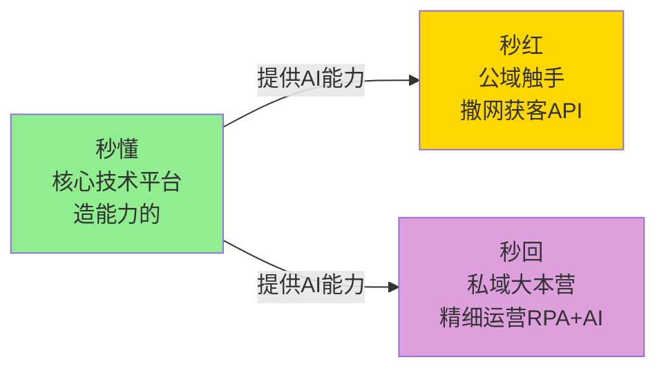
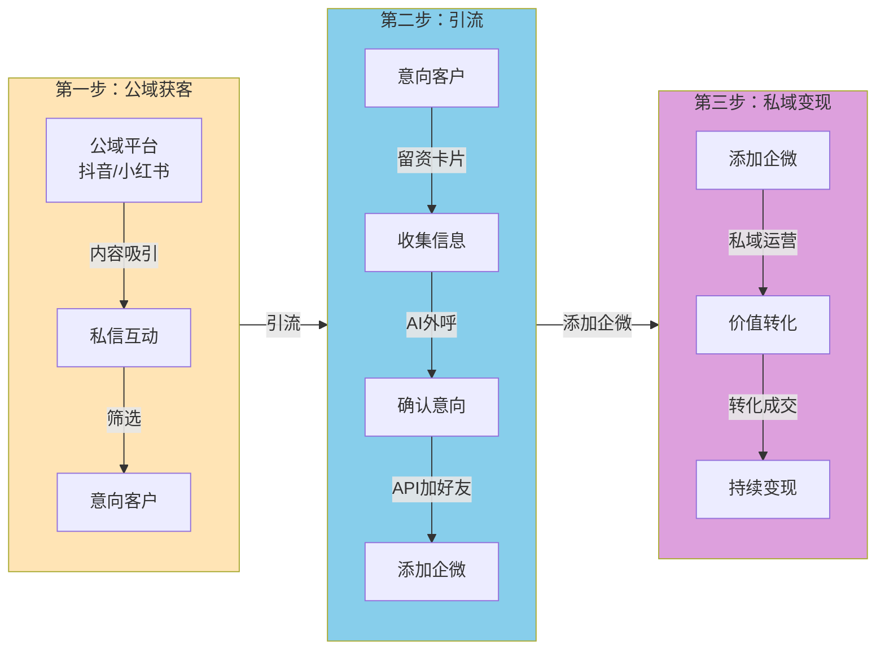
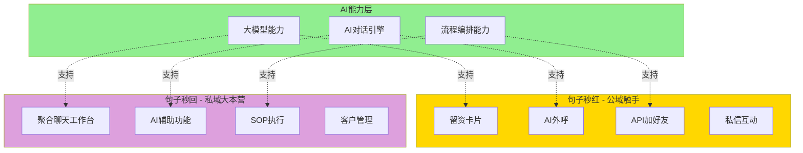
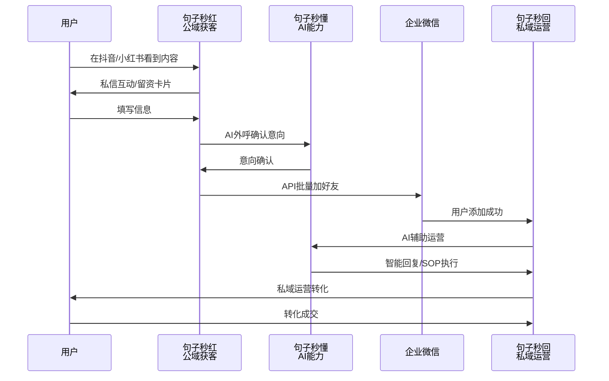

# 句子三款产品关系

## 核心定位

## 业务流转全流程

## 技术架构关系

## 完整业务流程

## 总结

### 三款产品各司其职

- **句子秒懂**：**核心技术平台** - 造能力的
  - 提供AI对话引擎、流程编排、大模型能力
  - 为秒红和秒回提供底层技术支持

- **句子秒红**：**公域触手** - 负责在抖音/小红书"撒网获客"（基于API）
  - 留资卡片、AI外呼、API加好友、私信互动
  - 在公域获取流量并筛选意向客户

- **句子秒回**：**私域大本营** - 负责在企微"精细运营"（基于RPA+AI）
  - 聚合聊天工作台、AI辅助、SOP执行、客户管理
  - 在私域进行深度运营和变现

### 业务价值

三款产品各司其职，打通了企业从**流量获取**到**价值变现**的全流程路径。
